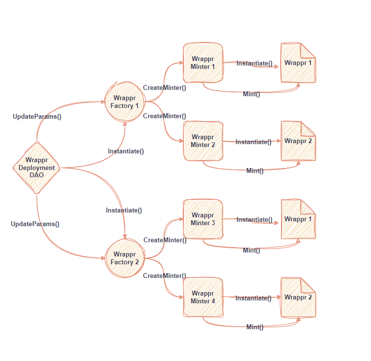

# Cw-Wrappr Contract

Welcome! This repo contains the [CosmWasm](https://cosmwasm.com/) implementation of [Wrappr](https://www.wrappr.wtf/).

## Architechture 


### Minter Factories

A minter factory is a singleton contract that encapsulates all governance parameters for a type of minter. It's sole responsibility is to instantiate new minters with the latest governance parameters.

Each factory also maintains an inventory of minters it has created, along with a verified, blocked, and explicit status for each. Goverance can vote to verify and block minters.

### Minters

Wrappr Launchpad can support various types of minters. CosmWasm developers are encouraged to contribute new types of minters. Developers can earn a fee from every mint via Fair Burn's [developer incentive](./packages/wrappr-fee/README.md).

### Collection contracts

Wrappr collections are based on cw721 and 100% compatible with the cw721 spec. Wrappr-721 simply adds on-chain collection-level metadata. Developers are encouraged to contribute different types of collection contracts.

## DISCLAIMER

WRAPPR CONTRACTS IS PROVIDED “AS IS”, AT YOUR OWN RISK, AND WITHOUT WARRANTIES OF ANY KIND. No developer or entity involved in creating or instantiating Wrappr smart contracts will be liable for any claims or damages whatsoever associated with your use, inability to use, or your interaction with other users of Wrappr, including any direct, indirect, incidental, special, exemplary, punitive or consequential damages, or loss of profits, cryptocurrencies, tokens, or anything else of value.


## General Flow

### 1. Wrappr Factory Instantitated
``````